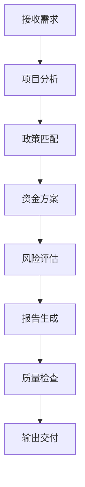

# 政策项目谋划工作流

## 概述

整合政策匹配、资金方案、风险评估、报告生成的完整项目谋划流程。

## 触发条件

1. 用户请求项目谋划
2. 需要匹配政策资金
3. 生成申报材料
4. 创建项目报告

## 工作流程



## 详细步骤

### Step 1: 项目分析

```python
def analyze_project(project_info):
    return {
        "project_type": classify_project(project_info),
        "investment_scale": calculate_scale(project_info),
        "key_features": extract_features(project_info),
        "applicable_domains": identify_domains(project_info)
    }
```

### Step 2: 政策匹配

```python
def match_policies(project_analysis):
    policies = search_policy_database(
        domains=project_analysis["applicable_domains"],
        investment_range=project_analysis["investment_scale"]
    )
    
    return rank_by_relevance(policies, project_analysis)
```

### Step 3: 资金方案

```python
def create_funding_plan(matched_policies, project_info):
    return {
        "primary_funding": select_primary_funding(matched_policies),
        "supplementary_funding": find_supplementary(matched_policies),
        "funding_ratio": calculate_ratios(project_info),
        "timeline": create_timeline(project_info)
    }
```

### Step 4: 风险评估

```python
def assess_risks(project_info, funding_plan):
    return {
        "policy_risks": check_policy_compliance(project_info),
        "funding_risks": evaluate_funding_stability(funding_plan),
        "timeline_risks": assess_timeline_feasibility(project_info),
        "mitigation_strategies": suggest_mitigations()
    }
```

### Step 5: 报告生成

```python
def generate_report(project_info, policies, funding, risks):
    template = load_template("project_planning_report")
    
    return render_report(template, {
        "project": project_info,
        "policies": policies,
        "funding": funding,
        "risks": risks,
        "recommendations": generate_recommendations()
    })
```

## 输出格式

### 项目谋划报告结构

```markdown
# 项目谋划报告

## 项目概况
- 项目名称
- 项目类型
- 投资规模
- 建设地点

## 政策匹配
- 适用政策列表
- 匹配度分析
- 申报条件核对

## 资金方案
- 主要资金来源
- 配套资金安排
- 资金时序计划

## 风险评估
- 政策风险
- 资金风险
- 进度风险
- 应对措施

## 下一步建议
- 近期工作
- 申报时间节点
- 注意事项
```

## 调用的Skills

| 阶段 | Skill | 用途 |
|------|-------|------|
| 政策匹配 | research-lookup | 政策研究 |
| 资金方案 | xlsx | 数据处理 |
| 风险评估 | scientific-critical-thinking | 风险分析 |
| 报告生成 | office | 文档生成 |
| 质量检查 | verification-before-completion | 验证 |

## 示例用法

```
用户: 帮我谋划一个老旧小区改造项目，投资5000万

系统:
1. 分析项目 → 老旧小区改造，城市更新领域
2. 匹配政策 → 中央预算内投资、专项债券、城市更新示范
3. 资金方案 → 中央预算70% + 地方配套30%
4. 风险评估 → 申报时间、资质要求
5. 生成报告 → 项目谋划报告.pdf
```

## 注意事项

1. **政策时效性**: 确保引用的政策现行有效
2. **资金比例**: 不超过政策规定的上限
3. **申报条件**: 逐项核对是否符合要求
4. **时间节点**: 注意申报截止日期

## See Also

- policy-knowledge-workflow - 政策知识管理
- research-lookup - 政策研究
- office - 文档生成
